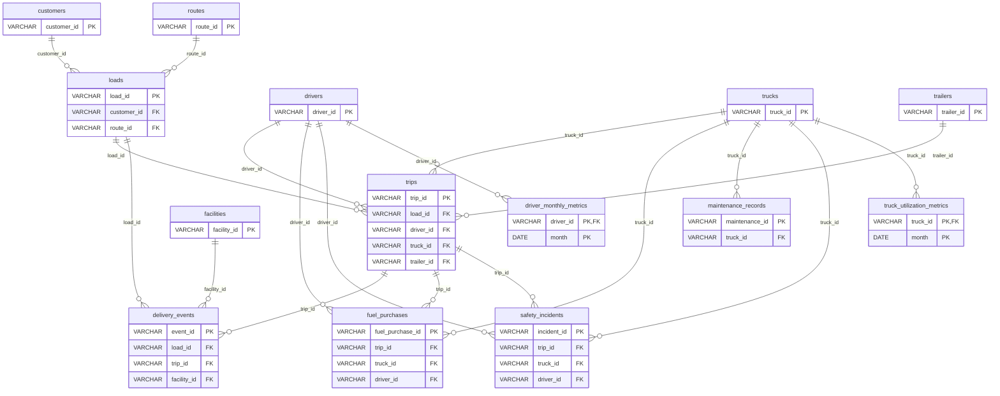

# 02 · Data Model

> Generated from `src/logops/data_platform/schema.py` by `uv run logops docs`. Do not edit by hand. · Vietnamese: [02-data-model.vi.md](02-data-model.vi.md)

The warehouse declares no physical PK/FK constraints: in DuckDB they would stop the build on a bad row instead of flagging it, and block rebuilding parent tables. The keys below are declared in `schema.py` and checked on every build by the data-quality rules `pk_unique`, `fk_missing` and `fk_orphan` (results in the `dq_findings` table).

## Relationships

Each line `parent ||--o{ child : "column"` reads: one parent row has zero or more child rows, joined on that column. Only key columns are shown; every column is listed in the data dictionary below.

## Data dictionary

### `customers`

Primary key: `customer_id`

| Column | Type | Key |
|---|---|---|
| `customer_id` | VARCHAR | PK |
| `customer_name` | VARCHAR |  |
| `customer_type` | VARCHAR |  |
| `credit_terms_days` | INTEGER |  |
| `primary_freight_type` | VARCHAR |  |
| `account_status` | VARCHAR |  |
| `contract_start_date` | DATE |  |
| `annual_revenue_potential` | INTEGER |  |

### `routes`

Primary key: `route_id`

| Column | Type | Key |
|---|---|---|
| `route_id` | VARCHAR | PK |
| `origin_city` | VARCHAR |  |
| `origin_state` | VARCHAR |  |
| `destination_city` | VARCHAR |  |
| `destination_state` | VARCHAR |  |
| `typical_distance_miles` | INTEGER |  |
| `base_rate_per_mile` | DOUBLE |  |
| `fuel_surcharge_rate` | DOUBLE |  |
| `typical_transit_days` | INTEGER |  |

### `facilities`

Primary key: `facility_id`

| Column | Type | Key |
|---|---|---|
| `facility_id` | VARCHAR | PK |
| `facility_name` | VARCHAR |  |
| `facility_type` | VARCHAR |  |
| `city` | VARCHAR |  |
| `state` | VARCHAR |  |
| `latitude` | DOUBLE |  |
| `longitude` | DOUBLE |  |
| `dock_doors` | INTEGER |  |
| `operating_hours` | VARCHAR |  |

### `drivers`

Primary key: `driver_id`

| Column | Type | Key |
|---|---|---|
| `driver_id` | VARCHAR | PK |
| `first_name` | VARCHAR |  |
| `last_name` | VARCHAR |  |
| `hire_date` | DATE |  |
| `termination_date` | DATE |  |
| `license_number` | VARCHAR |  |
| `license_state` | VARCHAR |  |
| `date_of_birth` | DATE |  |
| `home_terminal` | VARCHAR |  |
| `employment_status` | VARCHAR |  |
| `cdl_class` | VARCHAR |  |
| `years_experience` | INTEGER |  |

### `trucks`

Primary key: `truck_id`

| Column | Type | Key |
|---|---|---|
| `truck_id` | VARCHAR | PK |
| `unit_number` | VARCHAR |  |
| `make` | VARCHAR |  |
| `model_year` | INTEGER |  |
| `vin` | VARCHAR |  |
| `acquisition_date` | DATE |  |
| `acquisition_mileage` | INTEGER |  |
| `fuel_type` | VARCHAR |  |
| `tank_capacity_gallons` | INTEGER |  |
| `status` | VARCHAR |  |
| `home_terminal` | VARCHAR |  |

### `trailers`

Primary key: `trailer_id`

| Column | Type | Key |
|---|---|---|
| `trailer_id` | VARCHAR | PK |
| `trailer_number` | VARCHAR |  |
| `trailer_type` | VARCHAR |  |
| `length_feet` | INTEGER |  |
| `model_year` | INTEGER |  |
| `vin` | VARCHAR |  |
| `acquisition_date` | DATE |  |
| `status` | VARCHAR |  |
| `current_location` | VARCHAR |  |

### `loads`

Primary key: `load_id`

| Column | Type | Key |
|---|---|---|
| `load_id` | VARCHAR | PK |
| `customer_id` | VARCHAR | FK (references `customers`) |
| `route_id` | VARCHAR | FK (references `routes`) |
| `load_date` | DATE |  |
| `load_type` | VARCHAR |  |
| `weight_lbs` | INTEGER |  |
| `pieces` | INTEGER |  |
| `revenue` | DOUBLE |  |
| `fuel_surcharge` | DOUBLE |  |
| `accessorial_charges` | DOUBLE |  |
| `load_status` | VARCHAR |  |
| `booking_type` | VARCHAR |  |

### `trips`

Primary key: `trip_id`

| Column | Type | Key |
|---|---|---|
| `trip_id` | VARCHAR | PK |
| `load_id` | VARCHAR | FK (references `loads`) |
| `driver_id` | VARCHAR | FK (references `drivers`) |
| `truck_id` | VARCHAR | FK (references `trucks`) |
| `trailer_id` | VARCHAR | FK (references `trailers`) |
| `dispatch_date` | DATE |  |
| `actual_distance_miles` | INTEGER |  |
| `actual_duration_hours` | DOUBLE |  |
| `fuel_gallons_used` | DOUBLE |  |
| `average_mpg` | DOUBLE |  |
| `idle_time_hours` | DOUBLE |  |
| `trip_status` | VARCHAR |  |

### `delivery_events`

Primary key: `event_id`

| Column | Type | Key |
|---|---|---|
| `event_id` | VARCHAR | PK |
| `load_id` | VARCHAR | FK (references `loads`) |
| `trip_id` | VARCHAR | FK (references `trips`) |
| `event_type` | VARCHAR |  |
| `facility_id` | VARCHAR | FK (references `facilities`) |
| `scheduled_datetime` | TIMESTAMP |  |
| `actual_datetime` | TIMESTAMP |  |
| `detention_minutes` | INTEGER |  |
| `on_time_flag` | BOOLEAN |  |
| `location_city` | VARCHAR |  |
| `location_state` | VARCHAR |  |

### `fuel_purchases`

Primary key: `fuel_purchase_id`

| Column | Type | Key |
|---|---|---|
| `fuel_purchase_id` | VARCHAR | PK |
| `trip_id` | VARCHAR | FK (references `trips`) |
| `truck_id` | VARCHAR | FK (references `trucks`) |
| `driver_id` | VARCHAR | FK (references `drivers`) |
| `purchase_date` | TIMESTAMP |  |
| `location_city` | VARCHAR |  |
| `location_state` | VARCHAR |  |
| `gallons` | DOUBLE |  |
| `price_per_gallon` | DOUBLE |  |
| `total_cost` | DOUBLE |  |
| `fuel_card_number` | VARCHAR |  |

### `maintenance_records`

Primary key: `maintenance_id`

| Column | Type | Key |
|---|---|---|
| `maintenance_id` | VARCHAR | PK |
| `truck_id` | VARCHAR | FK (references `trucks`) |
| `maintenance_date` | DATE |  |
| `maintenance_type` | VARCHAR |  |
| `odometer_reading` | INTEGER |  |
| `labor_hours` | DOUBLE |  |
| `labor_cost` | DOUBLE |  |
| `parts_cost` | DOUBLE |  |
| `total_cost` | DOUBLE |  |
| `facility_location` | VARCHAR |  |
| `downtime_hours` | DOUBLE |  |
| `service_description` | VARCHAR |  |

### `safety_incidents`

Primary key: `incident_id`

| Column | Type | Key |
|---|---|---|
| `incident_id` | VARCHAR | PK |
| `trip_id` | VARCHAR | FK (references `trips`) |
| `truck_id` | VARCHAR | FK (references `trucks`) |
| `driver_id` | VARCHAR | FK (references `drivers`) |
| `incident_date` | TIMESTAMP |  |
| `incident_type` | VARCHAR |  |
| `location_city` | VARCHAR |  |
| `location_state` | VARCHAR |  |
| `at_fault_flag` | BOOLEAN |  |
| `injury_flag` | BOOLEAN |  |
| `vehicle_damage_cost` | DOUBLE |  |
| `cargo_damage_cost` | DOUBLE |  |
| `claim_amount` | DOUBLE |  |
| `preventable_flag` | BOOLEAN |  |
| `description` | VARCHAR |  |

### `driver_monthly_metrics`

Primary key: `driver_id`, `month`

| Column | Type | Key |
|---|---|---|
| `driver_id` | VARCHAR | PK, FK (references `drivers`) |
| `month` | DATE | PK |
| `trips_completed` | INTEGER |  |
| `total_miles` | INTEGER |  |
| `total_revenue` | DOUBLE |  |
| `average_mpg` | DOUBLE |  |
| `total_fuel_gallons` | DOUBLE |  |
| `on_time_delivery_rate` | DOUBLE |  |
| `average_idle_hours` | DOUBLE |  |

### `truck_utilization_metrics`

Primary key: `truck_id`, `month`

| Column | Type | Key |
|---|---|---|
| `truck_id` | VARCHAR | PK, FK (references `trucks`) |
| `month` | DATE | PK |
| `trips_completed` | INTEGER |  |
| `total_miles` | INTEGER |  |
| `total_revenue` | DOUBLE |  |
| `average_mpg` | DOUBLE |  |
| `maintenance_events` | INTEGER |  |
| `maintenance_cost` | DOUBLE |  |
| `downtime_hours` | DOUBLE |  |
| `utilization_rate` | DOUBLE |  |
